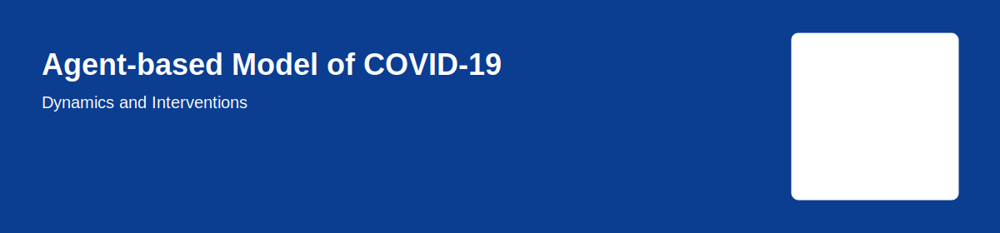
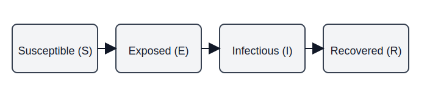
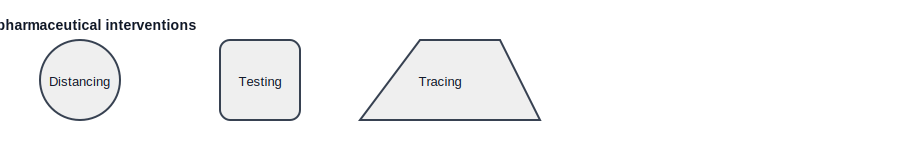

# Agent-based Model of COVID-19 Dynamics and Interventions

A concise, easy-to-read homepage for the project. This page gives an overview of the model, core ideas, and quick steps to reproduce results. The design is intentionally simple.

## About

This repository contains an agent-based simulation that models individual-level COVID-19 transmission and evaluates non-pharmaceutical interventions (NPIs) such as social distancing, testing & isolation, and contact tracing. The goal is to explore how combinations of interventions affect outbreak size and healthcare demand.

## How it works

The simulation represents agents moving between health states (Susceptible → Exposed → Infectious → Recovered). Transmission occurs through simulated contacts between agents; disease progression and intervention effects are modeled at the individual level.

## Key features

- Individual-level agents with configurable behavior and contact patterns
- Multiple interventions (social distancing, isolation/testing, contact tracing)
- Outputs for cases, hospitalizations, and intervention effectiveness
- Scripts/notebooks to run experiments and produce plots

## Interventions (examples)

Simple interventions include social distancing, isolation of symptomatic individuals, and contact tracing. Parameters for timing, compliance, and effectiveness are configurable.

## Quick start (local)

1. Clone the repository:

   git clone https://github.com/al190/Agent-based-Model-of-COVID-19-Dynamics-and-Interventions.git
2. Change to the project directory:

   cd Agent-based-Model-of-COVID-19-Dynamics-and-Interventions
3. (Optional) Create a virtual environment and activate it:

   python -m venv venv
   source venv/bin/activate   # macOS / Linux
   venv\Scripts\activate    # Windows
4. Install dependencies (if a requirements file exists):

   pip install -r requirements.txt
5. Run the main simulation script (adjust command if different in your repo):

   python run_simulation.py

Check the repository README for exact filenames and usage details.

## Presentation

View the project slides: https://docs.google.com/presentation/d/1SkSFu1Y4YiSsyPA2ts3Nockpy3MPqwsPSvDjXHDOo2I/edit?usp=sharing

## Contact

Maintainer: al190 — https://github.com/al190
